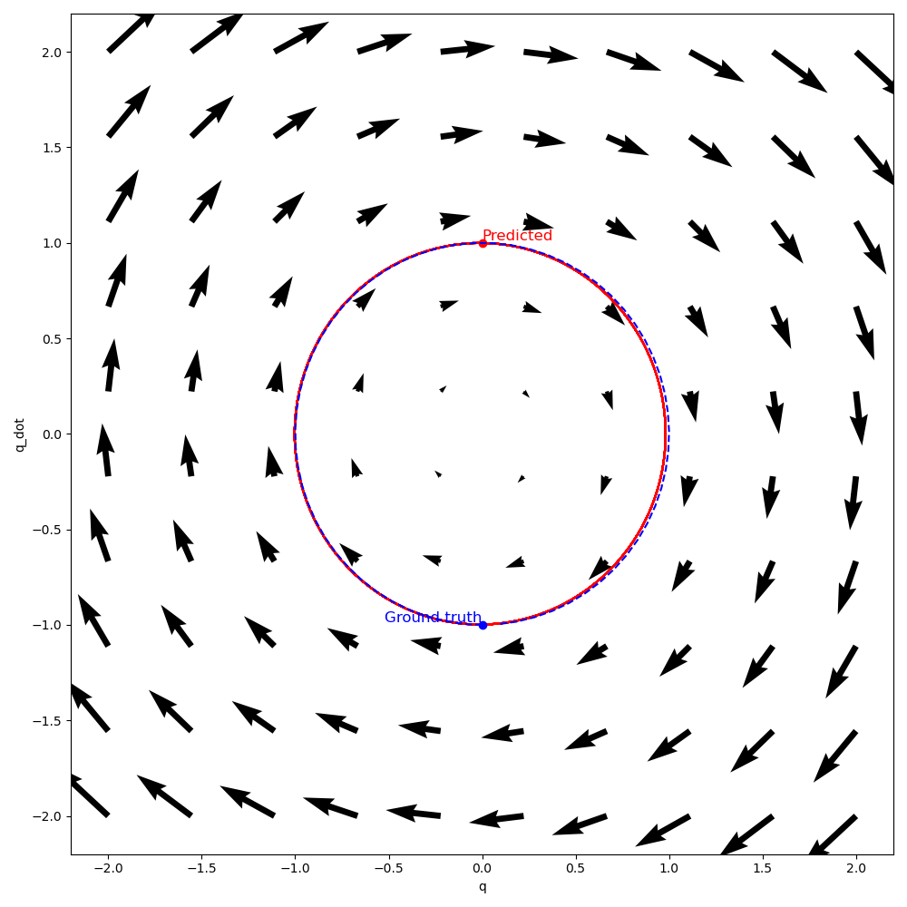

# Lagrangian NN
Project of a lagrangian nn inspired by a paper [Lagrangian Neural Networks](https://arxiv.org/pdf/2003.04630).

## Problem
Lagrangian network has a goal to learn a function $L(q, \dot{q})$ that approximates the lagrangian of that system. In general one would want to learn such lagrangian without EOMs, given only the data points $$\{q_i \dot{q}_i, \ddot{q}_i\}$$.

## Approach
To train such network, one needs a way to calculate loss of such network. Suppose, $(q(t), \dot{q}(t))$ are coordinates in phase space, parametrized by $t$. Then, Euler-Lagrange equations is:
$$\frac{d}{dt} \frac{\partial L}{\partial \dot{q}} - \frac{\partial L}{\partial q} = 0$$.
Applying chain rule and rearranging, it follows:
$$\ddot{q} = H_L^{-1} (\frac{\partial L}{\partial{q}} - [\frac{\partial^2 L}{\partial {q_i} \partial{\dot q_j}} ] \dot{q} )$$ where $H_L$ is a Hessian matrix.

At this stage one can just calculate loss an L2 loss between the predicted $\ddot{q}$ and actual $\ddot{q}_{target}$.

Fortunately, Pytorch has an autograd that allows a calculation of higher order derivatives.

### Harmonic oscillator
Consider a system of a harmonic oscillator, described by equations:
$$q(t) = A \cos(\omega t + \phi)$$
$$\dot{q}(t) = -A \omega \sin(\omega t + \phi)$$
$$\ddot{q}(t) = -A \omega^2 \cos(\omega t + \phi)$$
Dataset for the training was obtained from these EOMs with a Gaussian noise $\sigma=0.02$ applied.

#### Results
Model was successfully trained up to the loss of order 1e-1. Trained model was compared to the ground truth path given by the EOMs and the following phase space plot was obtained. It shows 10 full periods (dot is the starting point). Path was integrated with a 4th order Runge-Kutta method. One may observe that indeed path tends to stay the same and so does the energy of a system.

